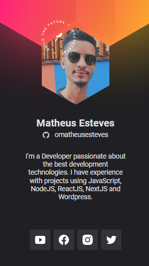

# cracha-nlw
Cracha virtual criado na trilha origin da NLW Heat 2021
<h1 align="center">
 🚧 Este Readme está em construção 🚧
</h1>

  <a href="#-tecnologias">Tecnologias</a>&nbsp;&nbsp;&nbsp;|&nbsp;&nbsp;&nbsp;
  <a href="#-projeto">Projeto</a>&nbsp;&nbsp;&nbsp;|&nbsp;&nbsp;&nbsp;
  <a href="#-layout">Layout</a>&nbsp;&nbsp;&nbsp;|&nbsp;&nbsp;&nbsp;
  <a href="#memo-licença">Licença</a>

 

  

## Site
- [omatheusesteves.com](https://omatheusesteves.github.io/cracha-nlw/)

## 🚀 Tecnologias

Esse projeto foi desenvolvido com as seguintes tecnologias:

- HTML
- CSS
- JavaScript

## 💻 Projeto
# WIP

Made with ♥ and a lot of ☕ by Matheus Esteves
